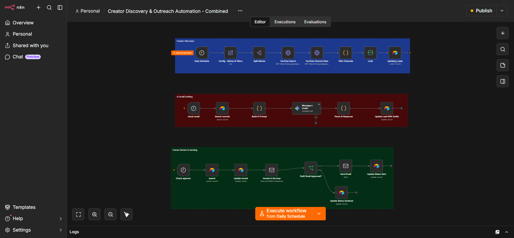

# Creator Discovery & Outreach

Finds creators, drafts the email, waits for a human.

Runs on a daily schedule across configured niches: searches YouTube, pulls channel statistics, filters to the ones worth contacting, and has Gemini draft a personalised email per lead. Nothing sends automatically: every draft goes to a human approval step first, and Airtable records whether it was approved, sent or declined.

**Category:** Outreach
**Status:** Live
**Tech:** n8n, Google Gemini, Airtable, YouTube API, Email
**Impact:** ~7 hours/week saved, based on daily channel research across every niche, plus a personalised draft written for each creator worth contacting.

Built and run in n8n. This repo holds the writeup and a screenshot of the live canvas; the workflow JSON itself is kept private.

Part of a portfolio of n8n automation builds: https://faiyaz-rahman.vercel.app
